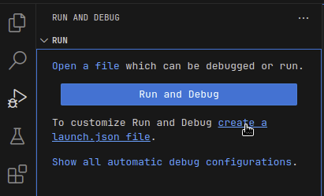

# Godot Tools

## The David´s Branch

This branch adds much needed code actions (the lightbulb at the left that lets you refractor code. I try to add that missing functionality

### What does it do?

* Firstly adds a simple action to export any variable, press (ctr+.) in a variable and it will appear an option to add @export at the start.
 - Bonus: it also detects where the variable is a float or int (a number) and gives you an option to export it as a range

* Secondly, it adds an option to refractor any code as a function or a variable.

Highlight any code and it will show an option to extract as a function or a variable. If it is a variable it will put it above the selection, and if is a function, it will put it after this function.

Additionally you can call a command (ctr+shift+p) to do the same

**Thats about it. For now**

Game development tools for working with [Godot Engine](http://www.godotengine.org/) in Visual Studio Code.

**IMPORTANT NOTE:** Versions 1.0.0 and later of this extension only support
Godot 3.2 or later.

- [Godot Tools](#godot-tools)
- [Features](#features)
- [Download](#download)
- [Commands](#commands)
- [Configuration](#configuration)
		- [Godot Editor](#godot-editor)
		- [VS Code](#vs-code)
- [GDScript Debugger](#gdscript-debugger)
		- [*Configurations*](#configurations)
	- [Issues and contributions](#issues-and-contributions)
- [Contributing](#contributing)
	- [FAQ](#faq)
		- [Why does it fail to connect to the language server?](#why-does-it-fail-to-connect-to-the-language-server)
		- [Why isn't IntelliSense displaying script members?](#why-isnt-intellisense-displaying-script-members)


# Features

(**bold items** are new in Godot Tools `v2.0.0`)
- **ALL FEATURES FULLY SUPPORT GODOT 4**
- GDScript (`.gd`) language features:
  - syntax highlighting
  - `ctrl+click` on any symbol to jump to its definition or **open its documentation**
  - `ctrl+click` on `res://resource/path` links
  - **hover previews on `res://resource/path` links**
  - **builtin code formatter**
  - autocompletions
  - full typed GDScript support
  - optional "Smart Mode" to improve productivity with dynamically typed scripts
  - Hover previews show function/variable definitions including doc-comments
  - **switch from a `.gd` file to the related `.tscn` file (default keybind is `alt+o`)**
  - display script warnings and errors
- GDScript Debugger features:
  - **completely rewritten, greatly improved reliability**
  - **new, simple configuration** (seriously, just hit F5!)
  - **convenient launch targets: current project/current file/pinned file**,
  - breakpoints
  - exceptions
  - step-in/out/over
  - variable watch
  - call stack
  - active scene tree
  - inspector
- GDResource (`.tscn` and `.tres`) language features:
  - syntax highlighting
  - **`ctrl+click` on `res://resource/path` links**
  - **`ctrl+click` on symbols to jump to its definition or open its documentation**
  - **hover previews show definitions of External and Sub Resources**
  - **hover previews on `res://resource/path` links**
  - **inlay hints to help visualize External and Sub Resources**
  - **in-editor Scene Preview**
- GDShader (`.gdshader`) language features:
  - syntax highlighting

# Download

- [Visual Studio Marketplace **(recommended)**](https://marketplace.visualstudio.com/items?itemName=geequlim.godot-tools)
  - Stable release, with support for automatic updates.
- [GitHub Releases](https://github.com/godotengine/godot-vscode-plugin/releases)
  - Stable release, but no automatic updates. Can be useful if you need to install an older version of the extension.
- [Development build (follows the `master` branch)](https://nightly.link/godotengine/godot-vscode-plugin/workflows/ci/master/godot-tools.zip)
  - Development build. Contains new features and fixes not available in stable releases, but may be unstable.
  - Extract the ZIP archive before installing (it contains the `.vsix` file inside).

To install from GitHub Releases or a development build,
see [Install from a VSIX](https://code.visualstudio.com/docs/editor/extension-marketplace#_install-from-a-vsix)
in the Visual Studio Code documentation.

# Commands

The extension adds a few entries to the VS Code Command Palette under "Godot Tools":

- Open workspace with Godot editor
- List Godot's native classes (and open thier documentation)
- Debug the current `.tscn`/`.gd` file
- Debug the pinned `.tscn`/`.gd` file
- Pin/Unpin the current `.tscn`/`.gd` file for debugging
- Open the pinned file

# Configuration

### Godot Editor

You can set VS Code as your default script editor for Godot by following these steps:

1. Open the **Editor Settings**
2. Select **Text Editor > External**
3. Check **Use External Editor** 
4. Fill **Exec Path** with the path to your VS Code executable
    * On macOS, this executable is typically located at: `/Applications/Visual Studio Code.app/Contents/MacOS/Electron`
5. Fill **Exec Flags** with `{project} --goto {file}:{line}:{col}`

You can make Godot seamlessly reload VSCode-edited scripts by changing some additional settings. More details about each are available when hovering over the description in the Settings window: 

- **Editor Settings > Text Editor > Behavior > Files > Auto Reload Scripts on External Change**
- **Editor Settings > Interface > Editor > Save on Focus Loss**
- **Editor Settings > Interface > Editor > Import Resources When Unfocused**

### VS Code

You can use the following settings to configure Godot Tools:

- `godotTools.editorPath.godot3`
- `godotTools.editorPath.godot4`

The path to the Godot editor executable. _Under Mac OS, this is the executable inside of Godot.app._

- `godotTools.lsp.headless`
  
When using Godot >3.6 or >4.2, Headless LSP mode is available. In Headless mode, the extension will attempt to launch a windowless instance of the Godot editor to use as its Language Server.

# GDScript Debugger

The debugger is for GDScript projects. To debug C# projects, use [C# Tools for Godot](https://github.com/godotengine/godot-csharp-vscode).

To configure the GDScript debugger:

1. Open the command palette (by pressing F1):
2. `>View: Show Run and Debug`
3. Click on "create a launch.json file"



4. Select the Debug Godot configuration.
5. Change any relevant settings.
6. Press F5 to launch.

### *Configurations*

Minimal:
```json
{
	"name": "Launch",
	"type": "godot",
	"request": "launch"
}
```

Everything:
```json
{
	"name": "Launch",
	"type": "godot",
	"request": "launch",
	"project": "${workspaceFolder}",
	"address": "127.0.0.1",
	"port": 6007,
	"scene": "main|current|pinned|<path>",
	"editor_path": "<path>",
	// engine command line flags
	"profiling": false,
	"single_threaded_scene": false,
	"debug_collisions": false,
	"debug_paths": false,
	"debug_navigation": false,
	"debug_avoidance": false,
	"debug_stringnames": false,
	"frame_delay": 0,
	"time_scale": 1.0,
	"disable_vsync": false,
	"fixed_fps": 60,
	// anything else
	"additional_options": ""
}
```

Godot's command flags are documented here: https://docs.godotengine.org/en/stable/tutorials/editor/command_line_tutorial.html

*Usage*

- Stacktrace and variable dumps are the same as any regular debugger
- The active scene tree can be refreshed with the Refresh icon in the top right.
- Nodes can be brought to the fore in the Inspector by clicking the Eye icon next to nodes in the active scene tree, or Objects in the inspector.
- You can edit integers, floats, strings, and booleans within the inspector by clicking the pencil icon next to each.


## Issues and contributions

The [Godot Tools](https://github.com/godotengine/godot-vscode-plugin) extension
is an open source project from the Godot organization. Feel free to open issues
and create pull requests anytime.

See the [full changelog](https://github.com/GodotExplorer/godot-tools/blob/master/CHANGELOG.md)
for the latest changes.

# Contributing

see [CONTRIBUTING.md](CONTRIBUTING.md)

## FAQ

### Why does it fail to connect to the language server?

- Godot 3.2 or later is required.
- Make sure the Godot editor is running
- Make sure to open the project in the Godot editor first. If you opened
  the editor after opening VS Code, you can click the **Retry** button
  in the bottom-right corner in VS Code.
- Reset the LSP Server port to the default values in both Godot's Editor Settings and
  in VSCode.

### Why isn't IntelliSense displaying script members?

- GDScript is a dynamically typed script language. The language server can't
  infer all variable types.
- To increase the number of results displayed, open the **Editor Settings**,
  go to the **Language Server** section then check **Enable Smart Resolve**.

### Can Godot/VSCode load in my script changes automatically instead of showing a confirmation window?

Godot has some Editor Settings that can help you if your workflow involves changing files in both editors:

- **Editor Settings > Text Editor > Behavior > Files > Auto Reload Scripts on External Change**
- **Editor Settings > Interface > Editor > Save on Focus Loss**
- **Editor Settings > Interface > Editor > Import Resources When Unfocused**
