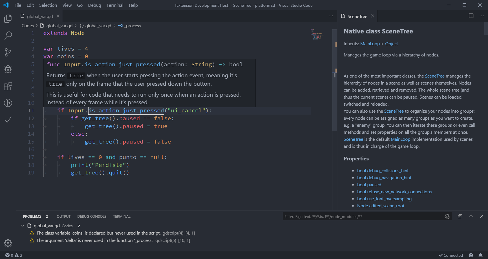
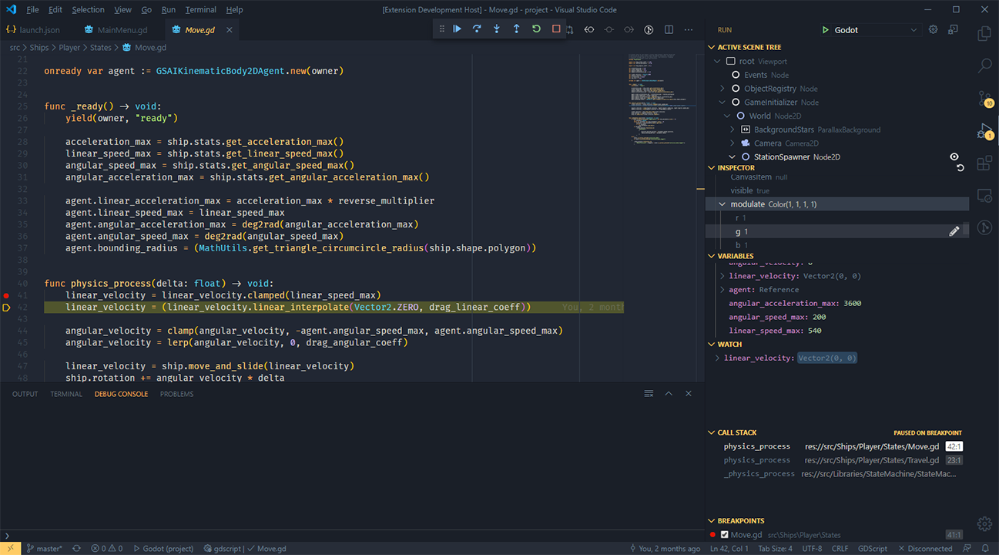

# Godot Tools

A complete set of tools to code games with
[Godot Engine](http://www.godotengine.org/) in Visual Studio Code.

> **Warning**
> 
> This plugin requires manual configuration to work with Godot 4!
> See the [`gdscript_lsp_server_port` setting](#gdscript_lsp_server_port)
> item under the Configuration section below.

**IMPORTANT NOTE:** Versions 1.0.0 and later of this extension only support
Godot 3.2 or later.

## Features

The extension comes with a wealth of features to make your Godot programming
experience as comfortable as possible:

- Syntax highlighting for the GDScript (`.gd`) language
- Syntax highlighting for the `.tscn` and `.tres` scene formats
- Full typed GDScript support
- Optional "Smart Mode" to improve productivity with dynamically typed scripts
- Function definitions and documentation display on hover (see image below)
- Rich autocompletion
- Display script warnings and errors
- Ctrl + click on a variable or method call to jump to its definition
- Full documentation of the Godot Engine's API supported (select *Godot Tools: List native classes of Godot* in the Command Palette)
- Run a Godot project from VS Code
- Debug your GDScript-based Godot project from VS Code with breakpoints, step-in/out/over, variable watch, call stack, and active scene tree

## Download

- [Visual Studio Marketplace **(recommended)**](https://marketplace.visualstudio.com/items?itemName=geequlim.godot-tools)
  - Stable release, with support for automatic updates.
- [GitHub Releases](https://github.com/godotengine/godot-vscode-plugin/releases)
  - Stable release, but no automatic updates. Can be useful if you need to install an older version of the extension.
- [Development build (follows the `master` branch)](https://nightly.link/godotengine/godot-vscode-plugin/workflows/ci/master/godot-tools.zip)
  - Development build. Contains new features and fixes not available in stable releases, but may be unstable.
  - Extract the ZIP archive before installing (it contains the `.vsix` file inside).

To install from GitHub Releases or a development build,
see [Install from a VSIX](https://code.visualstudio.com/docs/editor/extension-marketplace#_install-from-a-vsix)
in the Visual Studio Code documentation.

## Available commands

The extension adds a few entries to the VS Code Command Palette under "Godot Tools":

- Open workspace with Godot editor
- Run the workspace as a Godot project
- List Godot's native classes

## Configuration

### Godot

If you like this extension, you can set VS Code as your default script editor
for Godot by following these steps:

1. Open the **Editor Settings**
2. Select **Text Editor > External**
3. Make sure the **Use External Editor** box is checked
4. Fill **Exec Path** with the path to your VS Code executable
    * On macOS, this executable is typically located at: `/Applications/Visual Studio Code.app/Contents/MacOS/Electron`
5. Fill **Exec Flags** with `{project} --goto {file}:{line}:{col}`

### VS Code

#### Settings

You can use the following settings to configure Godot Tools:

##### `editor_path`

The absolute path to the Godot editor executable. _Under Mac OS, this is the executable inside of Godot.app._

##### `gdscript_lsp_server_port`

The WebSocket server port of the GDScript language server.

For Godot 3, the default value of `6008` should work out of the box.

**For Godot 4, this value must be changed to `6005` for this extension to connect to the language server.**
See [this tracking issue](https://github.com/godotengine/godot-vscode-plugin/issues/473) for more information.

#### GDScript Debugger

The debugger is for GDScript projects. To debug C# projects, use [C# Tools for Godot](https://github.com/godotengine/godot-csharp-vscode).

To configure the GDScript debugger:

1. Open the command palette:
2. `>Debug: Open launch.json`
3. Select the Debug Godot configuration.
4. Change any relevant settings.
5. Press F5 to launch.

*Configurations*

_Required_

- "project": Absolute path to a directory with a project.godot file. Defaults to the currently open VSCode workspace with `${workspaceFolder}`.
- "port": Number that represents the port the Godot remote debugger will connect with. Defaults to `6007`.
- "address": String that represents the IP address that the Godot remote debugger will connect to. Defaults to `127.0.0.1`.

_Optional_

- "launch_game_instance": true/false. If true, an instance of Godot will be launched. Will use the path provided in `editor_path`. Defaults to `true`.
- "launch_scene": true/false. If true, and launch_game_instance is true, will launch an instance of Godot to a currently active opened TSCN file. Defaults to `false`.
- "scene_file": Path _relative to the project.godot file_ to a TSCN file. If launch_game_instance and launch_scene are both true, will use this file instead of looking for the currently active opened TSCN file.

*Usage*

- Stacktrace and variable dumps are the same as any regular debugger
- The active scene tree can be refreshed with the Refresh icon in the top right.
- Nodes can be brought to the fore in the Inspector by clicking the Eye icon next to nodes in the active scene tree, or Objects in the inspector.
- You can edit integers, floats, strings, and booleans within the inspector by clicking the pencil icon next to each.

## Issues and contributions

The [Godot Tools](https://github.com/godotengine/godot-vscode-plugin) extension
is an open source project from the Godot organization. Feel free to open issues
and create pull requests anytime.

See the [full changelog](https://github.com/GodotExplorer/godot-tools/blob/master/CHANGELOG.md)
for the latest changes.

### Building from source

#### Requirements

- [npm](https://www.npmjs.com/get-npm)

#### Process

1. Open a command prompt/terminal and browse to the location of this repository on your local filesystem.
2. Download dependencies by using the command `npm install`
3. When done, package a VSIX file by using the command `npm run package`.
4. Install it by opening Visual Studio Code, opening the Extensions tab, clicking on the More actions (**...**) button in the top right, and choose **Install from VSIX...** and find the compiled VSIX file.

When developing for the extension, you can open this project in Visual Studio Code and debug the extension by using the **Run Extension** launch configuration instead of going through steps 3 and 4. It will launch a new instance of Visual Studio Code that has the extension running. You can then open a Godot project folder and debug the extension or GDScript debugger.

## FAQ

### Why does it fail to connect to the language server?

- Godot 3.2 or later is required.
- For Godot 4, the [`gdscript_lsp_server_port` setting](#gdscript_lsp_server_port)
  must be changed to `6005` to match the Godot editor's new default
  language server port number.
- Make sure to open the project in the Godot editor first. If you opened
  the editor after opening VS Code, you can click the **Retry** button
  in the bottom-right corner in VS Code.

### Why isn't IntelliSense displaying script members?

- GDScript is a dynamically typed script language. The language server can't
  infer all variable types.
- To increase the number of results displayed, open the **Editor Settings**,
  go to the **Language Server** section then check **Enable Smart Resolve**.
