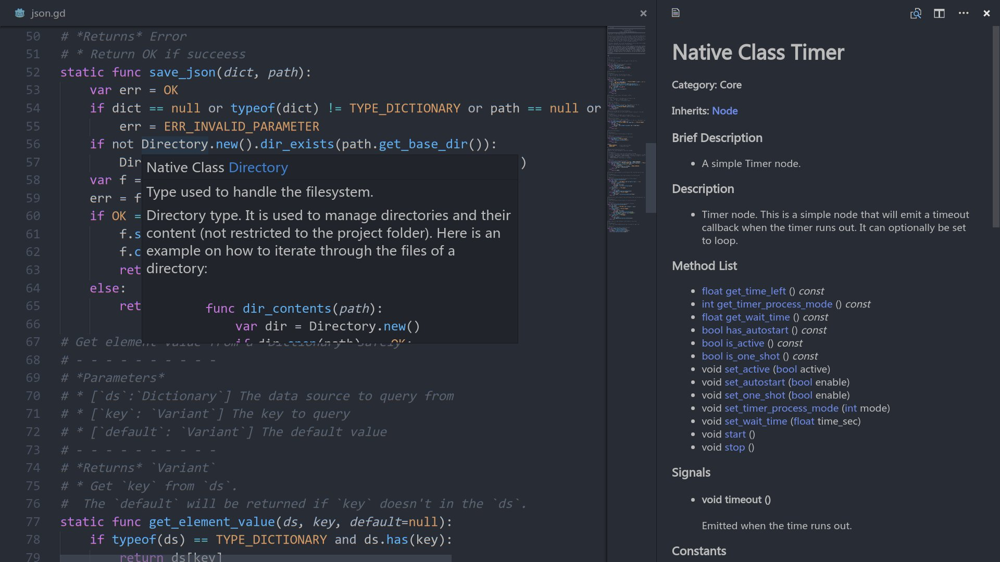

A complete set of tools to code games with the [Godot game engine](http://www.godotengine.org/) in Visual Studio Code.

## Features

The extension comes with a wealth of features to make your programming experience as comfortable as possible:

- Syntax highlighting for the GDscript language
- Syntax highlighting for the tscn and tres scene formats
- Function definitions and documentation on hover
- Rich auto completion
- Static code validation
- Open projects and scenes in Godot from VScode
- Ctrl-click on a variable or method call to jump to its definition
- Full documentation of the Godot engine API supported

## Available Commands

The extension adds a few entries to the command palette:

- Update Workspace Symbols
- Run workspace as Godot project
- Open workspace with Godot editor
- Run current scene

## Settings

If you like this extension you can set VSCode as your default script editor with following steps:
1. Open editor settings
2. Select `Text Editor / External`
3. Check the `Use External Editor` box with mouse click
4. Fill `Exec Path` to the path of your Visual Studio Code
5. Fill `Exec Flags` with `{project} --goto {file}:{line}:{col}`

You can use the following settings to configure Godot Tools:
- **GodotTools.godotVersion** - The Godot version of your project
- **GodotTools.editorPath** - An absolute path pointing at the Godot Editor executable file. Required to run the project and test scenes from VScode
- **GodotTools.workspaceDocumentWithMarkdown** - Control the documentations of workspace symbols should be rendered as plain text or html from markdown
- **GodotTools.workspaceDocumentWithMarkdown** - Control the documentations of workspace symbols should be rendered as plain text or html from markdown
- **GodotTools.ignoreIndentedVars** - Parse variables defined after indent of not
- **GodotTools.parseTextScene** - Parse scene files with extension ends with tscn
- **GodotTools.completeNodePath** - Show node paths of of workspace in the code completion
- **GodotTools.godotProjectRoot** - The Godot project directory wich contains project.godot or engine.cfg

## Issues and Contributions

The [Godot Tools](https://github.com/GodotExplorer/godot-tools) extension and  [engine modules](https://github.com/GodotExplorer/editor-server) are all hosted on GitHub. Feel free to open issues there and create pull requests anytime.

## FAQ
   
### Intellisense isn't showing up for me

Make sure you save your .gd file, then run "GodotTools: Update Workspace Symbols" from the command palate

[Full change log](https://github.com/GodotExplorer/godot-tools/blob/master/CHANGELOG.md)

## TODOS:
* Convert official BBCode documentation into Markdown and render it to HTML with documentation previewer pages
* Add mermaid support with documentation
* Undefined variable checking
